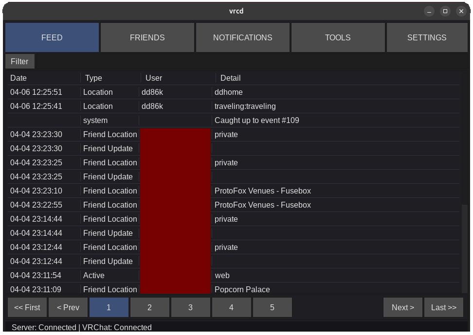

# vrcd



A little companion suite for VRChat, written in D.

Features:
- VR friendly UI
- Server-client architecture to avoid having multiple connections to VRC APIs
- Relatively light client using software rendering
- Relatively simple API with "catch up" request (that's for my FOMO)
- Embed world and player metadata into VRChat screenshots
- VR overlay notifications (XSOverlay, OVR Toolkit) and desktop

```text
+ ~ ~ ~ ~ ~ ~ ~ ~ ~ ~ ~+
| VRChat API (HTTP/WS) |
+~ ~ ~ ~ ~ ~ ~ ~ ~ ~ ~ +
      ^
   HTTP/WS
      v
+----------------+                 +-----------------+
| vrcd-server    | <- JSON-L ** -> | vrcd-client     |
| - VRC API sync |                 | - Picture meta  |
| - State        |                 | - Notifications |
+----------------+                 +-----------------+

** May change
```

- **[Server](server/)** -- Stays connected to VRChat's WebSocket 24/7, records events to SQLite, and serves them over TCP.
- **[Client](client/)** -- Connects to the server, watches local VRChat logs, and injects metadata into screenshots.

Targets Windows and Linux.

## Quick Start

```bash
# Build
dub build :server
dub build :client

# Test
dub test :server
dub test :client
```

See each component's README for dependencies, configuration, and architecture details.
