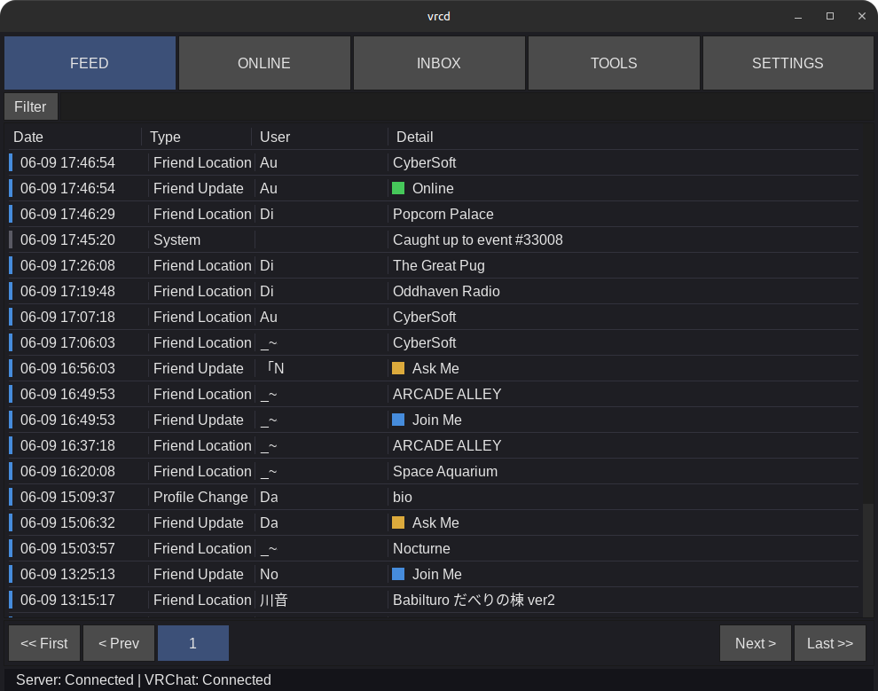
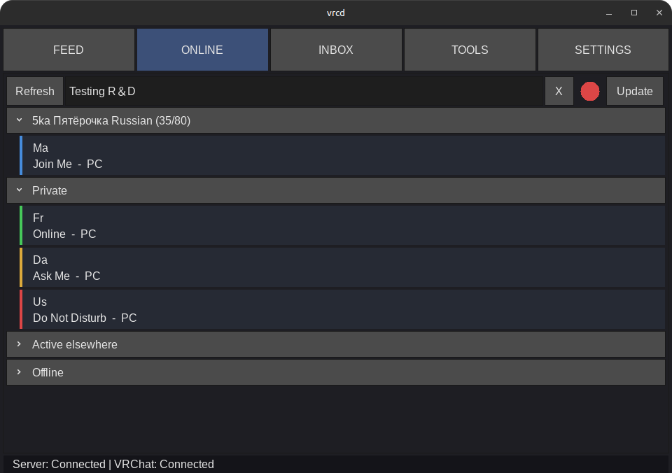

#  vrcd

A little companion suite for VRChat to help you track friend activity,
inject metadata into photos, and receive VR/desktop notifications.

It features a server-client architecture, to avoid having multiple connections to VRC APIs.

> [!WARNING]
> Status: Most features present. Stable for daily use; Under active development.
> 
> Otherwise, get ready to frequently pull, upgrade dependencies, and build!

> [!WARNING]
> The client requires an active running vrcd server and packages do not come with the server.
>
> There are plans to fix this.

Client features:
- Relatively light client using software rendering; Hardware option available.
- VR friendly UI.
- Embed world and player metadata into VRChat photos automatically.
- Strip VRChat and other metadata from VRChat photos.
- VR overlay notifications (XSOverlay/WayVR, OVR Toolkit) and desktop notifications.
- [Drop a Portal](https://dropaport.al/) integration.

Server features:
- Record incoming VRChat events.
- Event-stream API with 'catch-up' and 'back-fill' actions to know what you missed.

Feel free to join the official [VRChat group](https://vrc.group/VRCD.7796) (`VRCD.7796`)!

Related projects:
- [vrcd-server-container](https://github.com/ArcaneDisgea/vrcd-server-container) by ArcaneDisgea.

## Screenshots

### Feed Page



### Online Page



## Installing

See [Compiling](#compiling).

After connecting to the server, the authentication will be forward to the
first connected client. After connecting, you should be good to go!

### Linux: pipehelper

The pipehelper subpackage is used to make "Open in VRChat" button work.

You'll need to make a Windows build of pipehelper with `dub build :pipehelper`
in Windows, and place `vrcd-pipehelper.exe` next to the `vrcd_client` executable
or in `~/.config/vrcd`. No Steam launch options are needed: the client runs the
helper with the Proton build VRChat itself is running under, against the game's
prefix, which attaches it to the wineserver holding the launch pipe.

If the helper is missing, or the IPC attempt fails, the client falls back
to a server-side self-invite.

# For Developers

## Architecture

```text
+ ~ ~ ~ ~ ~ ~ ~ ~+
| VRChat servers |
+~ ~ ~ ~ ~ ~ ~ ~ +
        ^
HTTP requests/WS events
        v
+----------------+              +-----------------+
| vrcd-server    | <- JSON-L -> | vrcd-client(s)  |
| - VRC API sync |              | - Picture meta  |
| - Friend state |              | - Notifications |
+----------------+              +-----------------+
        ^
      JSON-L
        v
+----------------+                    +----------+
| vrcd-web       | <- Stateless WS -> | Browser  |
| Acts like a    |                    | - Notifs |
| client         |                    | - etc. ! |
+----------------+                    +----------+
```

Targets:
- **[Server](server/)**: Stays connected to VRChat's WebSocket 24/7, records events to SQLite, and serves them over TCP.
- **[Client](client/)**: Connects to the server, watches local VRChat logs, and injects metadata into photos.

Targets Windows and Linux.

## Compiling

See each component's README for dependencies, configuration, and architecture details.

In short:
- Client needs SDL2 dynamic libraries (SDL2, SDL2_ttf, SDL2_image), libcurl static library,  and optionally OpenSSL.
- Server needs libcurl and sqlite static libraries and optionally OpenSSL.

```bash
# Upgrade dependencies for server and client
dub upgrade -s

# Build, test, and run server (might be best to setup config first)
# For more info, see server/README.md
dub build :server
dub test :server
./client/vrcd_server

# Build, test, and run client
# For more info, see client/README.md
dub build :client
dub test :client
./client/vrcd_client
```

See [API.md](./API.md) for server-client API details.

### Issues

- Using LDC 1.41 on Windows will lead to compiling issues: undefined PAGESIZE in core.thread.fiber

# Contributing

I'm unsure how I want to handle contributions at this moment, sorry.

However, feel free to submit bugs in Issues and feature suggestions in Discussions, thanks.

# Disclaimer

This software is provided as-is without any warranty and is not affiliated with VRChat.

VRCD does not modify the game client in any shape, nor does it reflect the views
or opinions of VRChat. It is only an external tool using the VRChat API.

Users are still responsible for complying with VRChat's Terms of Service.

VRChat is copyrighted work of VRChat Inc.

# License

Both the server and client components are licensed BSD-3-Clause-Clear.
