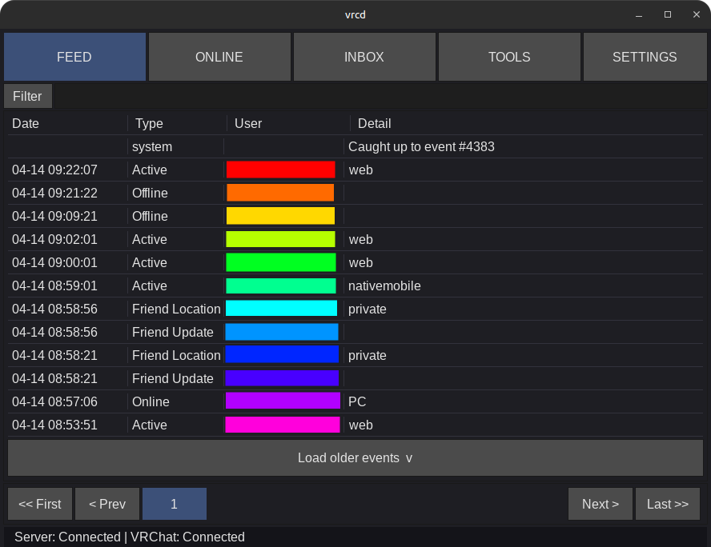
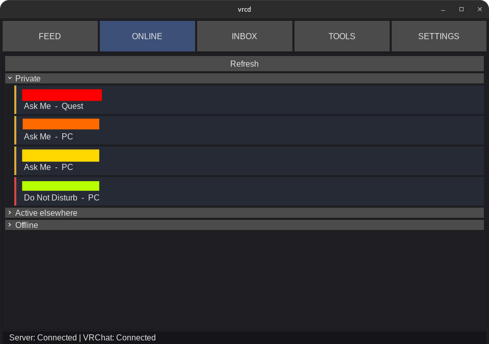

#  vcrd

A little companion suite for VRChat to help you track friend activity, manage photos,
and receive VR/desktop notifications.

Features:
- VR friendly UI
- Server-client architecture, to avoid having multiple connections to VRC APIs
- Relatively light client using software rendering; Hardware option available
- Event-stream API: Requests 'catch-up' events at startup to avoid missing activity
- Embed world and player metadata into VRChat photos automatically
- Strip VRChat and other metadata from VRChat photos
- VR overlay notifications (XSOverlay, OVR Toolkit) and desktop notifications

Status: Most features present. Stable for daily use; active development.

Otherwise, get ready to frequently pull, upgrade dependencies, and build!

## Screenshots

### Feed Page



### Online Page



# For Developers

## Architecture

```text
+ ~ ~ ~ ~ ~ ~ ~ ~+
| VRChat servers |
+~ ~ ~ ~ ~ ~ ~ ~ +
        ^
HTTP requests/WS events
        v
+----------------+              +-----------------+
| vrcd-server    | <- JSON-L -> | vrcd-client(s)  |
| - VRC API sync |              | - Picture meta  |
| - Friend state |              | - Notifications |
+----------------+              +-----------------+
```

Targets:
- **[Server](server/)**: Stays connected to VRChat's WebSocket 24/7, records events to SQLite, and serves them over TCP.
- **[Client](client/)**: Connects to the server, watches local VRChat logs, and injects metadata into photos.

Targets Windows and Linux.

Related projects:
- [vrcd-server-container](https://github.com/ArcaneDisgea/vrcd-server-container) by ArcaneDisgea.

## Compiling

See each component's README for dependencies, configuration, and architecture details.

In short:
- Client needs SDL2 dynamic libraries (SDL2, SDL2_ttf, SDL2_image).
- Server needs libcurl and sqlite static libraries.

```bash
# Build server and client
dub build :server
dub build :client

# Unit tests
dub test :server
dub test :client

# Run server, see server/README.md for configuration options
./server/vrcd_server
# Run client, see client/README.md for its architecture
./client/vrcd_client
```

See [API.md](./API.md) for server-client API details.

# Contributing

At this time, it's best to write Issues for bugs and feature requests, or start
a Discussion.

# Disclaimer

This software is provided as-is without any warranty and is not affiliated with VRChat.

VRCD does not modify the game client in any shape, nor does it reflect the views
or opinions of VRChat. It is only an external tool using the VRChat API.

Users are still responsible for complying with VRChat's Terms of Service.

VRChat is copyrighted work of VRChat Inc.

# License

Both the server and client components are licensed BSD-3-Clause-Clear.
